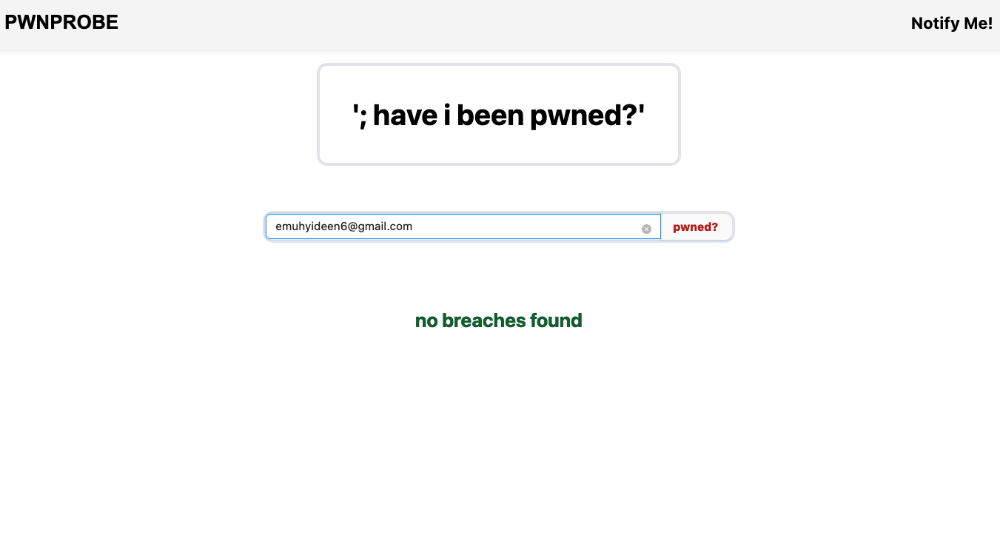
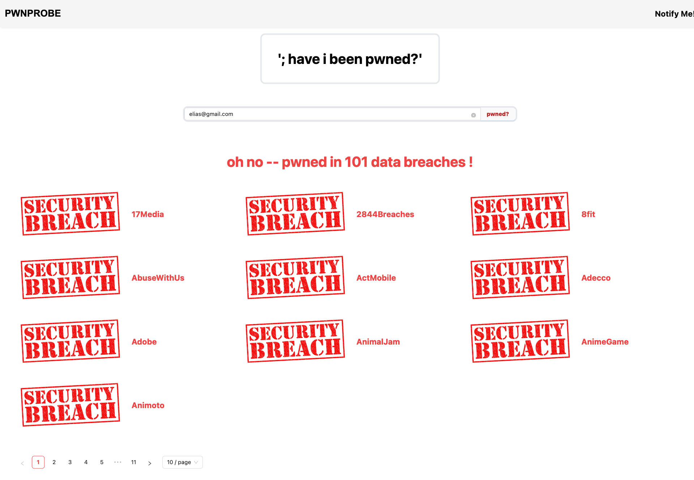
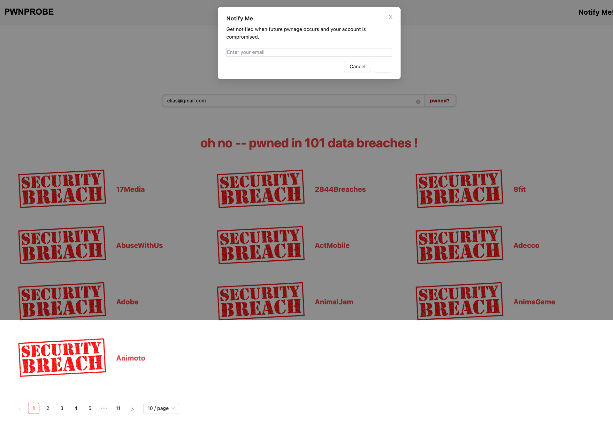

# PwnProbe
> The app aims to provide security-minded users with a valuable tool that empowers them to ascertain whether their email addresses have been compromised in data breaches. Moreover, if desired, they can opt to receive timely notifications regarding any future breaches that may impact their email accounts
## Live Demo

## Built With

- HTML
- CSS
- JavaScript
- Vite
- React
- Redux
- Linters

## Screenshot
no_breach.png
breach.png
notify.png

## Getting Started

To get a local copy up and running follow these simple example steps.

### Prerequisites

- NPM updated
- Modern web browser
- Git

### Setup

    git clone https://github.com/Fourteen98/Space-Travelers-Hub.git 

### Install
    npm install

### Usage
    npm run dev

### Deployment
    npm run deploy

## Authors

👤 Muhyideen Elias

GitHub: @fourteen98

- GitHub: [fourteen98](https://github.com/Fourteen98/)
- Twitter: [muhiydeen](https://twitter.com/muhiydeen)
- Linkedin: [muhyideen-elias](https://www.linkedin.com/in/muhyideen-elias-53719994/)

## 🤝 Contributing
Contributions, issues, and feature requests are welcome!

## Show your support

Give a ⭐️ if you like this project!

